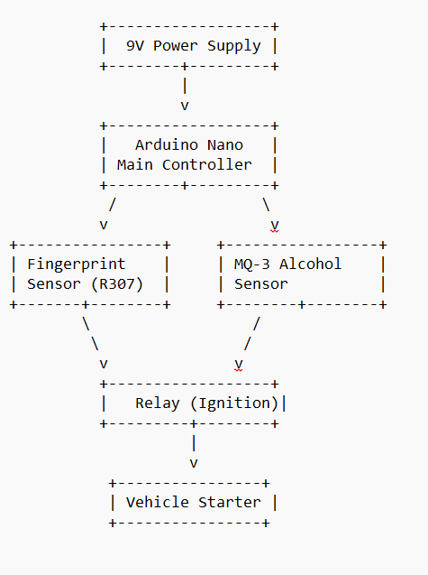

# Fingerprint Vehicle Starter with Drug/Alcohol Sensing

**About:**  
A fingerprint-based vehicle ignition system integrated with alcohol/drug detection to ensure only authorized users can start the vehicle safely.

---

## 📄 Project Report
You can download the project report here:  
[Fingerprint Vehicle Starter Report (Word)](Fingerprint_Vehicle_Starter_Report.docx)

---

## 🖼 Block Diagram
Here’s the block diagram of the system:

---

## 🔧 Hardware Requirements
- Arduino Nano  
- R307 Fingerprint Sensor  
- MQ-3 Alcohol Sensor  
- Relay Module  
- 9V Power Supply  
- Connecting Wires  
- Optional: LCD 16x2 with I2C  

---

## 💻 Software Requirements
- Arduino IDE  
- Adafruit Fingerprint Library  
- LiquidCrystal_I2C Library  

---

## ⚙️ Working Principle
1. The system is powered using a 9V supply.  
2. The MQ-3 alcohol sensor checks for alcohol/drug presence.  
3. The R307 fingerprint sensor verifies authorized users.  
4. If the user is authorized and no alcohol is detected:  
   - The relay is activated to start the vehicle.  
5. The LCD displays status messages such as:  
   - "Authorized! Start"  
   - "Access Denied"  
   - "Alcohol Detected"  

---

## 📝 Future Enhancements
- Add mobile app integration for remote monitoring.  
- Use GSM/GPS module to track vehicle location.  
- Integrate with a cloud database for logging authorized users and events.  

---

## 📜 License
This project is licensed under the MIT License. ✅
